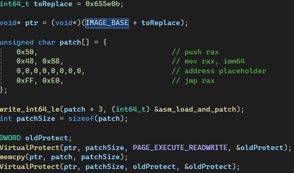
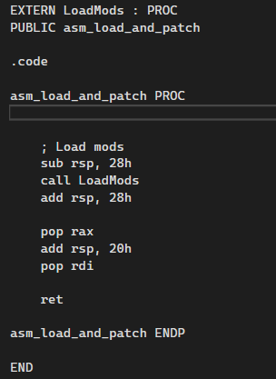
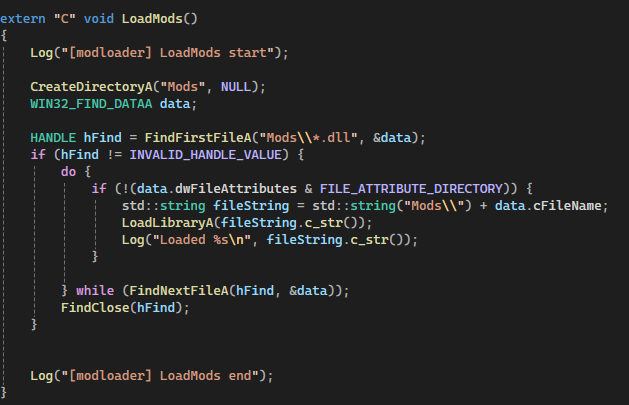

This is going to be your bread and butter for modding games, but honestly most of the time it is going to be fairly easy, and you will just need to patch the assembly in the area you want to modify and then jump to your own function.

This will change the behaviour at RUNTIME, you are not editing anything on the disk, this way you don't really break anything on the game files themselves.

This phase can generally be complete in 3 steps

### Assembly Patching

First you need to use your decompiler to track the function you want to patch, after that you need to make an absolute jump to one of our functions using an available register, in case the register will be used later, you can just push the register on the stack.

If your patching is overriding some instructions partially, you don't want to keep them broken like that, replace said instructions with NOP instructions, which are completely safe and do nothing. 

This is for x64, for x86 is way easier as you don't need to use imm64.

### Assembly Hooking

The jump will go to a function we defined ourself, you will need to define this jump function in assembly, because you will need to keep everything coherent, not corrupt the stack, and if your patching replaced some important instructions and not padding, you will need to redo them at the end of your assembly function.

Example using MSVC and MASM to define a function.

MSVC forces you to use a MASM file for x64 in C for defining assembly functions. It doesn't however force you for x86, where you can us `__asm`.

Many languages that support low level programming, might have such macros/functions to just define assembly directly without an extern file, for example [Rust](https://doc.rust-lang.org/reference/inline-assembly.html), in case you change you don't want to use C/C++, but this guide will focus on C/C++.

### Executing C/C++ Function

From the assembly you will need to execute a C function, where you can run some logic in higher level, depending on the arguments and outputs of your function, you might need to push and pop all the volatile registers before calling your C function, it is very important that you align your stack correctly.

If your C/C++ function uses floats or doubles, don't forget to backup their specific registers (like XMM registers for instance).

If you are brave enough, or the logic is simple enough, or you are some kind of assembly genius, you can skip this and just do everything you must do in assembly.

---

This guide used a mod loader for an example, the modloader structure is very similar to the mod one, with the only different is that its context is not yet inside the game's memory.