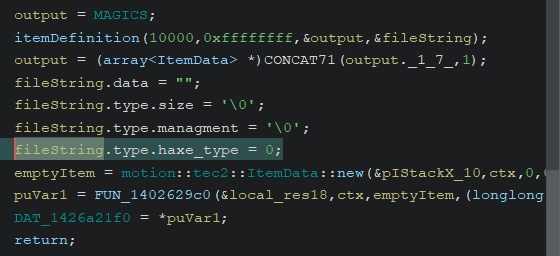

I will rewrite the objective here in case the Reverse Engineering section hard resetted someone's head (it kinds of does that, not very easy topics).

> The objective is adding custom items to the game, each item has a picture, but for the sake of simplifying for now we will target only adding items themselves and maybe recycle the image assets of other items.

So we can handle this in a lot of different ways.

Q: Do we reimplement XML parsing ourselves or do we hook to the native functions?

A: I am lazy, let's just hook to the XML parse function.

Q: So when do we actually parse the stuff? When the dll is loaded said section wasn't been run yet, and probably the `GLOBAL_REGISTRY` with all items is not yet alive.

A: Slighly before the end of the `tec2::Deserialize::allItemDefinitions` function, because I don't understand what is going on at the very end.

We are going to add items from a XML file format, the files will be located in `/Mods/Assets/*.xml`.

You can find the complete source code at [TEC2AssetAdder](https://github.com/Intybyte/TEC2AssetAdder).

Keep in mind you will have to do a lot of trial and errors sometimes, you won't mod anything in a day. While writing these sections it took me a lot to not mess up some calls in Assembly, so don't feel too discouraged, it is the way it is.

Now that everything has been said, let's get started!