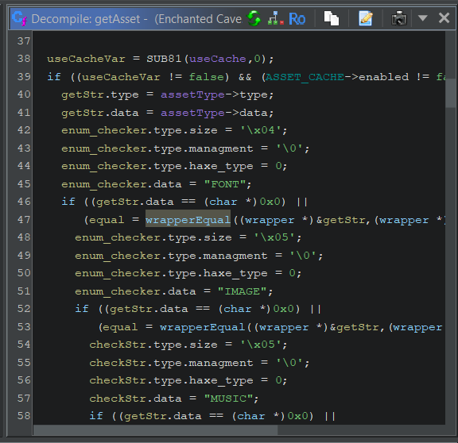
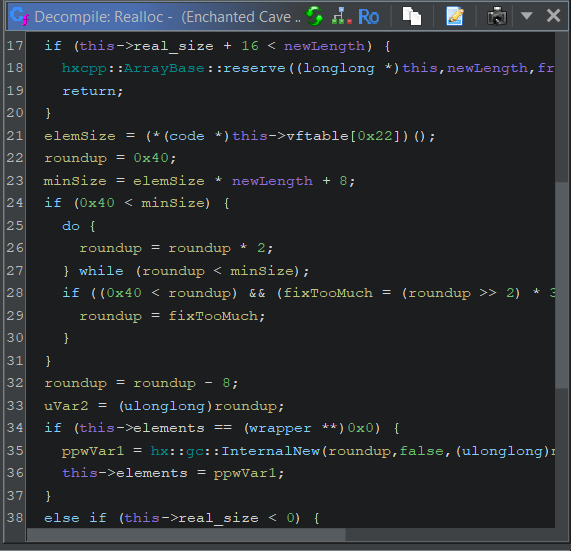
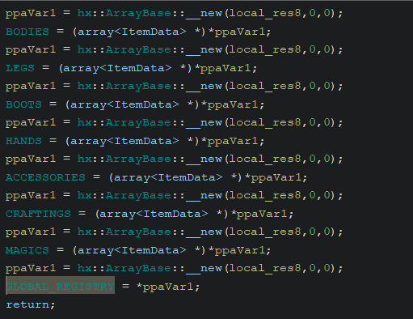

Let's figure out how the data is parsed into the data structures.

The first function call is `FUN_1405d44e0`, which is just a wrapper of function `FUN_14035a350`. Inside the first call of said function there are a lot of Strings:

- "TEXT"
- "IMAGE"
- "MUSIC"
- "SOUND"
- "TEMPLATE"
- "BINARY"
- "TEXT"

And a function that confronts one of the parameter to said strings. After some digging in the source code this is none other than `Assets#getAsset`, so let's rename it properly.

`FUN_140359610 -->dynamic * lime::Assets::getAsset(dynamic *output,String *assetId,String *assetType,longlong useCache)`

Where dynamic is a simple struct with only one vtable. And we can conclude that the function that confronts said string is some kind of String equal function or wrapper equal function. So I will rename it to `wrapperEqual`, where `wrapper` is the same data structure as String, with the only difference that instead of having a `char*` in the data field it has a `void*`.



Now let's try understanding better where the results are saved and what haxe is going.

Towards the end we can see a temp variable used to save the reference of the output parameter, it also calls `FUN_14092dbd0`, so let's figure out what output is and what this function does.

Chat GPT says it is a reallocation function, so I go to hxcpp to see Haxe's Array implementation for C++, and I find that this function is the `Array#Realloc` function, so let's rename it properly to make it match the one in hxcpp source code.



`FUN_14092dbd0 --> void hxcpp:ArrayBase::Realloc(array *this,int newLength,longlong from,longlong param_4)`

The last param might be Ghidra allucinating stuff, but I don't want to fight Ghidra too hard so I am keeping it there. It was also easy to reconstruct the functions used inside said function by just looking up the source code, in fact we can find `hx::InternalNew` and `hxcpp::ArrayBase::reserve`.

We can also deduce the definition of Array of object classes:

```
0x0	0x8	addr *	undefined * *	vftable	
0x8	0x4	int	int	mArrayConvertId	
0xc	0x1	??	undefined		
0xd	0x1	??	undefined		
0xe	0x1	??	undefined		
0xf	0x1	??	undefined		
0x10	0x4	int	int	length	
0x14	0x4	int	int	real_size	
0x18	0x8	dynamic * *	dynamic * *	elements	
```

I have seen some Arrays with primitive types which might have a different structure, they don't use dynamic at the end but `int**` for instance.

This will be useful for when we need to handle arrays to pass to the deserialization function.

From other functions that write to the GLOBAL_REGISTRY and alike, and decompiling said function calls we can also obtain the `hx::ArrayBase::__new` function

