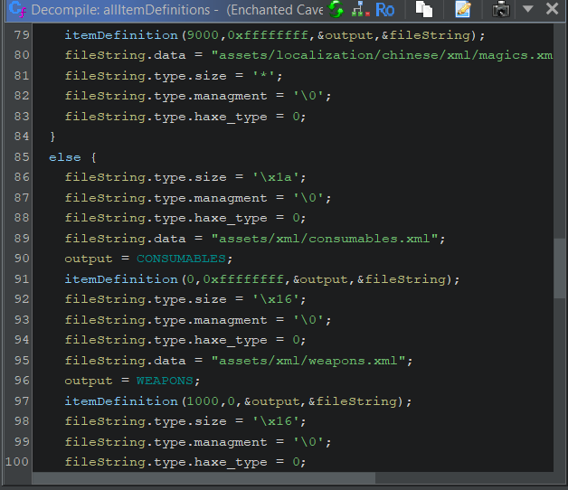

From a quick string search we can easly find that there are XML files embedded within the "Enchanted Cave 2.exe" executable, so we can just perform a string search based on the XML attributes in order to find out what exactly is parsing/processing them.

We find the function `FUN_140489740`, which processes said data and stores them into an object, also from the call tree we see a function that calls this function various times, once for each category of Items, we hit the jackpot, let's rename these functions and the parameters.

`FUN_140489740 --> void tec2::Deserialize::allItemDefinitions(int idOffset,uint flagParam,void **output,String *stringFile)`

We also figure out the basic structure of the String wrapper used by Haxe.

And the function loading all the item definitions are

`FUN_140489260 --> void tec2::Deserialize::itemDefinitions(void)`

There seems also to be chinese language support, and the parameters name are derived from the way the function is called.

I made a `type_info` struct with a total size of 32bits, named type, but after some analysis I believe that it is just a `uint32_t` length field, and Ghidra or hxcpp compiler are just adding unnecessary stuff to make it more complex than it actually is, but I am keeping it like this for now.