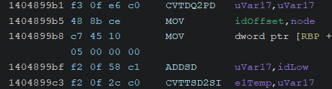

This section will give you the tools to get started reverse engineering the game, a crucial step
in order to mod the game properly, because you need to know what you need to fix/change before
applying any real changes.

Many of these tools are not exclusive to hxcpp modding as you can infer, however the sections will have some more details regarding this enviroment whenever possible.

Also to use these tools properly you will need to have a basic understanding of these stuff, you can acquire such knowledge fairly easly with enough dedication and if you already have a good background:

### C language 

Most decompilers will decompile the code to pseudo C, and honestly you are going to mod in C also, because due to architectue padding, you will need to create perfectly aligned structures in
order to use the game's functions.

### Assembly

Of course you should not know the entirety of assembly it would be insane, and we could argue for
hours on how CISC assembly languages are becoming more and more an interpreted language due to the sheer amount of instructions. But you need to know the basics:

- How does the stack works
- How to align the stack and work on it
- What are the functions call conventions (depends if target is 32bit or 64bit)
- How to NOT corrupt the stack
- How to backup and restore registries properly
- Be careful of anything that touches a float or double

Generally speaking you are only going to use instructions like:
PUSH, MOV, ADD, POP, SUB, JMP

So it is perfectly fine if you don't know what this is:

||\(It is floats, the bane of my existence, and soon yours too\)||

### No support

Let's be honest here, if you go and ask people about Assembly hooking, Assembly patching,
how does a GC work, or Reverse Engineering, you aren't going to get much out of it most of the 
time.

Realistically, you are alone trying to mod a game, unless it has a big enough audience which also
has someone as "insane" as yourself.

You need to have some basics about Google Dorking to find proper documentation, because most of
Google useful stuff is harder to find due to SEO bullshit.