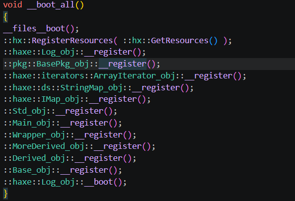
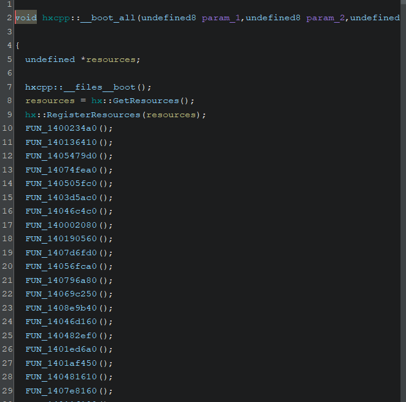

Locating the main common parts of hxcpp generated code will give you good insights on the classes that are present in the game, one of the main ones it the `__boot_all` generated by hxcpp.

`__boot_all` is also one of the first stuff that are executed, following it might lead to a good place where we can start loading the mods when we will create a mod loader.

This is what hxcpp will generated with few classes as a reference.

You can very easly detect this function, because they will be a lot of calls in one function, and all of them, beside the first one, will take no argument.

It will looks like something like this:

This will give you some insights of the general class structure:

- FQN name of the class
- Methods
- Fields
- Static stuff

That will be saved in a `::hx::Class` structures, it helps you reconstruct high level logic, but keep in mind you still need to figure out yourself which classes are what and the proper field alignment after padding.