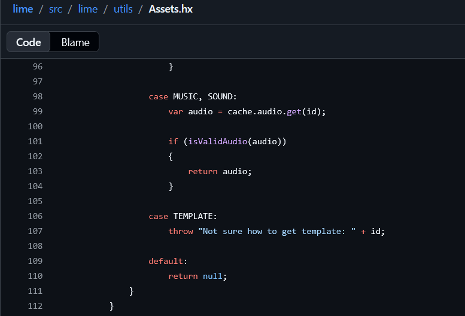
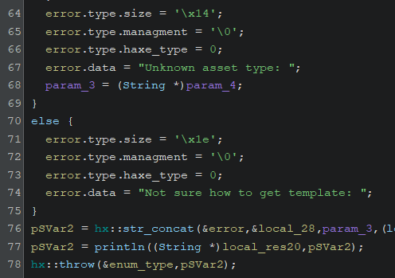

String literals are going to be very useful in this. Example:

You find that a weird function uses a string called `"Not sure how to get template: "` then you can search it on Google \(if you think it is a lib call, but you are not sure\), or on the docs, find that the `Assets.hx` class in Lime has it.

Then you now know where you are, that there is some weird string concatenation function, that the output of concatenating stuff is used in the throw, and now that half of the functions make sense, you can single out more easily the other stuff.

(Ignore the struct fields like managements and haxe_type, they are probably wrong and ghidra is making stuff up with the assembly, you are never going to get all the answers straight away)

